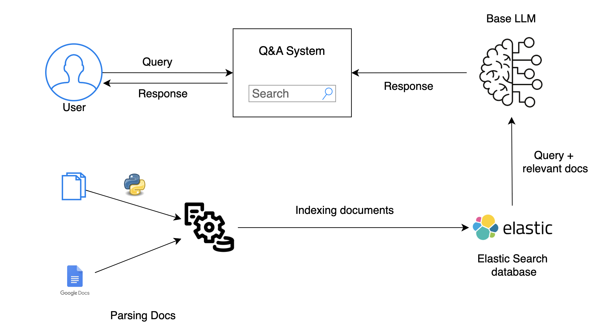

# FAQ Q&A System using RAG

This project explores Large Language Models (LLMs) and Retrieval-Augmented Generation (RAG) techniques. I implemented a simple RAG pipeline to answer questions based on FAQ documents from the Zoomcamp courses.

## Business Value

This project addresses the challenge of efficiently accessing information from extensive FAQ documents. By implementing a Q&A system, users can quickly find answers to their questions, improving productivity and enhancing the user experience.



## Key Features

- **Index Zoomcamp FAQ Documents**: Automatically index FAQ documents from different Zoomcamp courses.
  - **DE Zoomcamp**: [FAQ Document](https://docs.google.com/document/d/19bnYs80DwuUimHM65UV3sylsCn2j1vziPOwzBwQrebw/edit)
  - **ML Zoomcamp**: [FAQ Document](https://docs.google.com/document/d/1LpPanc33QJJ6BSsyxVg-pWNMplal84TdZtq10naIhD8/edit)
  - **MLOps Zoomcamp**: [FAQ Document](https://docs.google.com/document/d/12TlBfhIiKtyBv8RnsoJR6F72bkPDGEvPOItJIxaEzE0/edit)
- **Q&A System**: Develop a system to answer questions based on the indexed documents, leveraging LLM and RAG techniques.

## Use Case

Imagine PetSmart, a leading retail company in the pet industry, implementing this Q&A system to assist both customers and employees. Customers can quickly get answers to common questions about pet care, product information, and store policies. Employees can use the system to swiftly access internal guidelines and best practices, ensuring they provide accurate and consistent information to customers.

## User Benefits

- **Time Savings**: Quickly find answers to frequently asked questions without manually searching through documents.
- **Improved Efficiency**: Streamline information retrieval for Zoomcamp participants and organizers.
- **Enhanced User Experience**: Provide a seamless and intuitive way to access important information.

## Getting Started

To get started with the Zoomcamp FAQ Q&A system:

1. **Clone the Repository**: Clone this repository to your local machine.
2. **API keys**: Go to .env file and create your OPENAI or CLAUDE api key and save.
3. **Run the Q&A System**: Start the Q&A system in rag.ipynb and begin asking questions.

## Putting to test

#### Question:

```
Rag('What is Data Engineering Zoomcamp? Can it help someone become a data engineer? Write in short)

```

### Answer

```
Data Engineering Zoomcamp is a course designed to help individuals become data engineers. Here's a short overview:

Comprehensive Program: Covers essential data engineering topics.
Flexible Participation: The course is accessible even after the start date.
Hands-On Experience: Work with tools like Google Cloud, Python, Terraform, and Git.
Self-Paced Learning: Materials remain available after the course ends.
Community Support: Participants can ask questions and seek help through a Slack channel.
Practical Experience: Includes homework assignments and a final capstone project.
Real-World Preparation: Designed to prepare participants for real-world data engineering roles.
In summary, Data Engineering Zoomcamp can indeed help someone become a data engineer by providing structured learning, practical experience, and community support.
```

## Future Plans

- Add frontend to the Q&A system
- Expand the system to include more documents and enhance the accuracy of the Q&A responses by integrating more advanced NLP techniques.

## Contact

For more information, please reach out:

- **Email**: yash95kumar@gmail.com
- **LinkedIn**: [yashk1](https://www.linkedin.com/in/yashk1)
