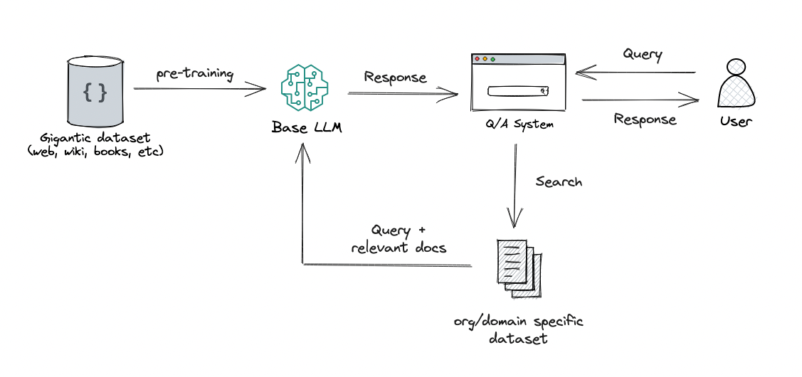

# Build a Q&A RAG system for course-related FAQ documents

The practical goal is to build a Q&A system for Zoomcamp FAQ documents, enhancing the understanding and application of LLM and RAG technologies.

* Index Zoomcamp FAQ documents
  * DE Zoomcamp: [https://docs.google.com/document/d/19bnYs80DwuUimHM65UV3sylsCn2j1vziPOwzBwQrebw/edit](https://docs.google.com/document/d/19bnYs80DwuUimHM65UV3sylsCn2j1vziPOwzBwQrebw/edit)
  * ML Zoomcamp: [https://docs.google.com/document/d/1LpPanc33QJJ6BSsyxVg-pWNMplal84TdZtq10naIhD8/edit](https://docs.google.com/document/d/1LpPanc33QJJ6BSsyxVg-pWNMplal84TdZtq10naIhD8/edit)
  * MLOps Zoomcamp: [https://docs.google.com/document/d/12TlBfhIiKtyBv8RnsoJR6F72bkPDGEvPOItJIxaEzE0/edit](https://docs.google.com/document/d/12TlBfhIiKtyBv8RnsoJR6F72bkPDGEvPOItJIxaEzE0/edit)
* Create a Q&A system for answering questions about these documents

First. let's understand what is the difference between LLM and RAG

# LLM and RAG

## Large Language Models (LLMs)

* **Purpose:** Generate and understand text in a human-like manner.
* **Structure:** Built using deep learning techniques, especially Transformer architectures.
* **Size:** Characterized by having a vast number of parameters (billions to trillions), enabling nuanced understanding and generation.
* **Training:** Pre-trained on large datasets of text to learn a broad understanding of language, then fine-tuned for specific tasks.
* **Applications:** Used in chatbots, translation services, content creation, and more.

## Retrieval-Augmented Generation (RAG)

* **Purpose:** Enhance language model responses with information retrieved from external sources.
* **How It Works:** Combines a language model with a retrieval system, typically a document database or search engine.
* **Process:**
  * *Queries an external knowledge source based on input.*
  * Integrates retrieved information into the generation process to provide contextually rich and accurate responses.
* **Advantages:** Improves the factual accuracy and relevance of generated text.
* **Use Cases:** Fact-checking, knowledge-intensive tasks like medical diagnosis assistance, and detailed content creation where accuracy is crucial.

Further reading : https://blogs.nvidia.com/blog/what-is-retrieval-augmented-generation/
